# 🎮 **Dessert, at nighttime** 

> **Short Pitch**: A game where you participate in a desert. Talk to the people at the table, hear out their woes and... decide whether you get anythingout of it. // A short game featuring ~10 minutes of gameplay with dialogue and turn based combat.

---

## 🌐 **Play the Game**
[Click here to play the game!](https://lemonsociopath.github.io/CCL1-REAL/)

---

## 📸 **Screenshots**

### Main Gameplay:

  
  
MEWO MEWO  MEOW EOWEM OW

---

### Menu and UI:

  
  
*Figure 2: Menu and user interface.*

---

## 🎨 **Spritesheets**
Below are the sprites used to create characters and objects in the game:

### Player Character:

  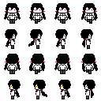
  
Sprite Sheet

  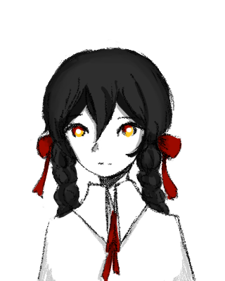
  
Battle Illustration

---

### Enemies and NPCs:

  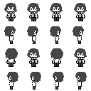
  
Spritesheet for the 'host' npc

  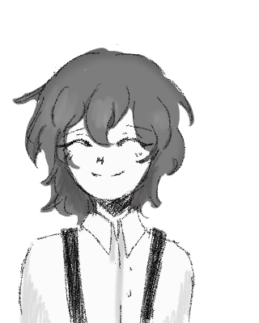
  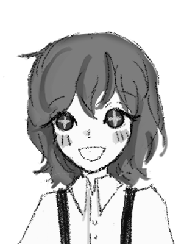
  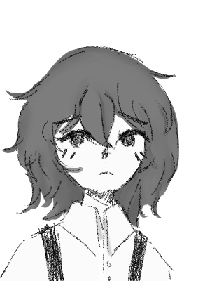
  
Different expressions for the host while talking

  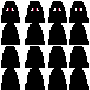
  
Spritesheet for the overworld npc's

  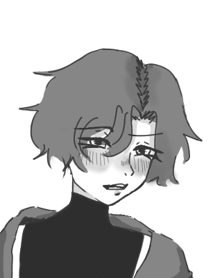
   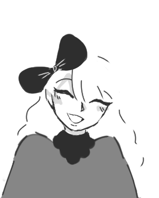
    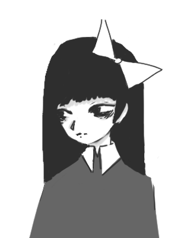
     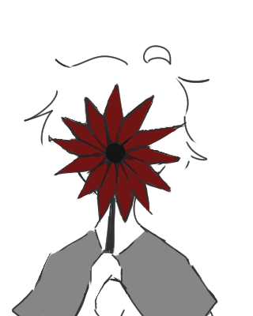
      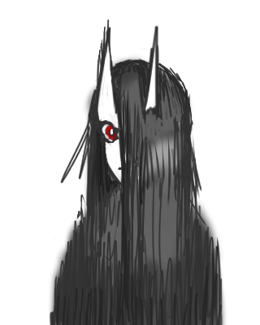
       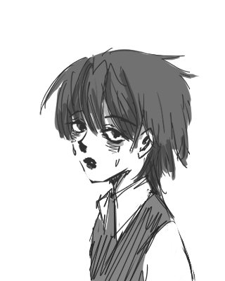
  
NPC battle/speech Illustrations

---

## ✍️ **Reflection**

### What went well:
- **Plans vs Reality:** I managed to complete basically everything I wanted out of my game.
- **Core Mechanics:** I was able to implement far more thanexpected, both in terms of status effects during battle and adding dialogue after certain accomplishamnts from the player.

### Challenges:
- **Pressure:** Both too much and not enough pressure. First week I was able to motivate myself to work nonstop, only to burn out in the second and spend 12+ hours sleeping most days since my mind couldn't handle it. Only on the final 48 hours I felt the dealine was harsh enough again that I managed to force myself out of bed.
- **Visual Fixes:** I had some issue with placement of elemens in the battle system, which I expected to be easy so I got more annoyed by it than I should have.

### Lessons Learned:
- **When under pressure, don't stand out:** Don't try to stand out because I suffered and couldn't ask peers for help since they had a completely different code.
- **Keep it Simple:** Focusing on one unique mechanic instead of multiple features made the game more polished.
